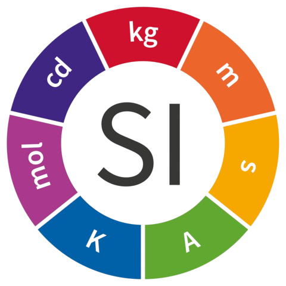

# Units




O `units` é uma ferramenta simples e prática de conversão de unidades tendo como foco as necessidades de Engenharia Civil. Desenvolvida para a matéria de Metodologia e Pesquisa da UTFPR-TD, ela facilita a conversão de unidades do Sistema Internacional de Unidades (SI) e outras unidades comumente utilizadas na área, promovendo precisão e eficiência nos cálculos.

## Status de Desenvolvimento

Data de lançamento a ser definida.

## Instruções

| Linux |
|:---:|

```bash
$ ./build.sh -help
$ ./build.sh -compile -run
```

| Windows |
|:---:|

Sem suporte (ainda).

## LICENSE

Este projeto está licenciado sob a [MIT License](https://opensource.org/licenses/MIT). Sinta-se à vontade para usar, modificar e distribuir o código conforme necessário.
